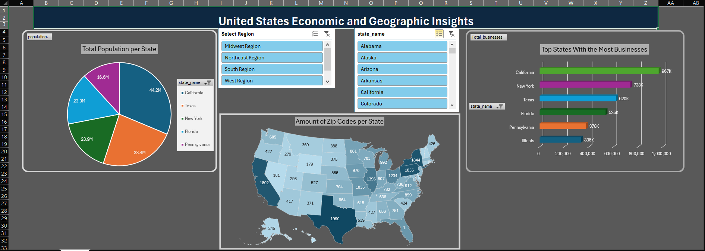
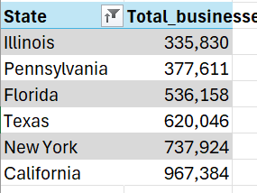
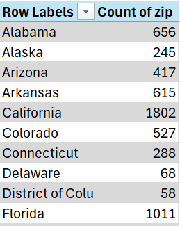
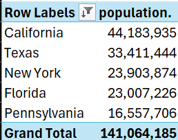
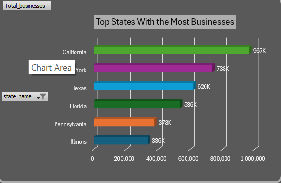
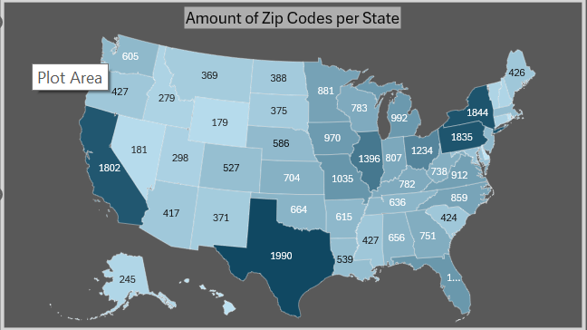
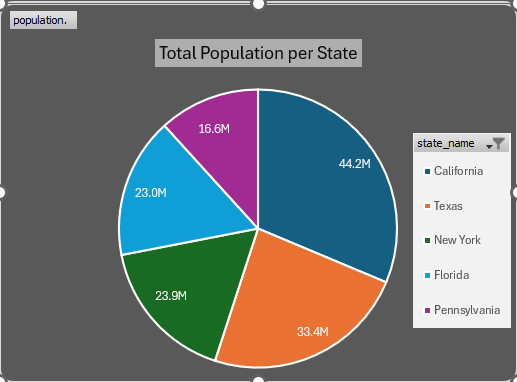

# United States Economic and Geographic Insights

# Introduction
This dashboard offers an interactive exploration of economic and geographic insights across the United States. It visualizes total population per state, the number of zip codes in each state, and highlights the top states with the most businesses, all in a single, easy-to-navigate interface. By selecting regions through a slicer, users can filter data dynamically to focus on specific parts of the country. Combining pie charts, filled maps, and bar charts, this dashboard provides a comprehensive look at how population, economic activity, and geographic distribution intersect, making it a powerful tool for uncovering patterns and trends in U.S. demographics and business presence.
### Excel File
[zip_code_demographics](zip_code_demographics.xlsx)
### Skills in Excel I Used
* Pivot Tables
* Pivot Charts

### Dataset
The original dataset contains detailed demographic and economic information for over 30,000 U.S. ZIP codes, including location attributes (city, state, county, latitude, longitude), population figures, income metrics (adjusted gross income, total income amount, number of tax returns), and business indicators like the number of businesses per zip code. The dataset was downloaded from Kaggle. The dataset used for this project was a table (called MyTable) that was a copy of the original dataset, with some of the columns deleted. Below are the columns used in this project:
* zip
* state_name
* population
* Region
* number_of_business
# Building the Dashboard
## Pivot Tables
**Total Businesses by State**

* Summarizes the number of businesses per state.

* Identifies economic hubs: California leads with ~967K businesses, followed by New York and Texas.

* Useful for comparing business density relative to population.

**Count of ZIP Codes per State**

* Counts the total number of ZIP codes for each state, indicating geographic complexity and coverage.
* Valuable for regional analysis, logistics planning, or market segmentation.

**Population by State**

* Displays total population summed across zip codes for each state.

* Highlights states with the largest populations, led by California (44.2M).

* Grand total shows combined population for the top states: 141 million+.
## Pivot Charts
**Total Businesses by State**

* Visualizes the number of businesses in the six leading states.
* Clearly shows California as the economic powerhouse with 967K businesses, far outpacing New York, Texas, and others.
* Makes it easy to compare state-level economic activity at a glance.

**Count of ZIP Codes per State**

* Displays the distribution of ZIP codes across the United States in a geographic heat map.

* Darker shades indicate states with a higher number of ZIP codes, such as Texas (1990), California (1802), and Pennsylvania (1835).

Helps visualize geographic complexity and coverage, essential for logistics, service planning, or regional analysis.
**Population by State**

* Visually breaks down total population across the five most populous states.

* Highlights California (44.2M) and Texas (33.4M) as the most populated, with New York, Florida, and Pennsylvania following.

* Useful for illustrating population concentration and state-level market potential.

# Conclusion
This project transformed detailed zip-level data into an interactive dashboard, revealing key economic and geographic insights across U.S. states. By combining PivotTables and PivotCharts, I created clear visualizations of total population, zip code distribution, and business presence, making it easy to spot patterns and compare states. Dynamic slicers let users filter by region or state for targeted analysis. Overall, this dashboard effectively turns raw demographic data into an intuitive tool for exploring population trends, market opportunities, and the geographic footprint of economic activity in the United States.

